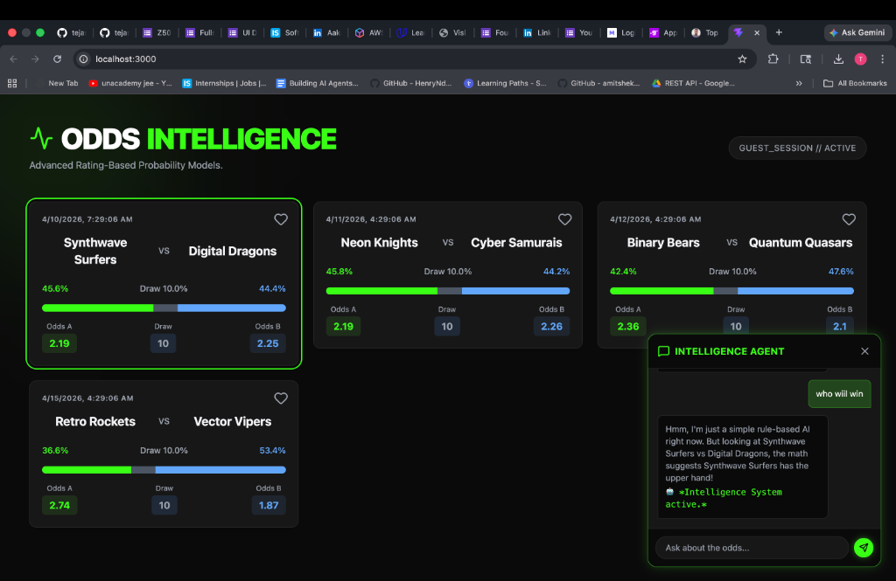

# 🏆 Sports Odds Intelligence Platform

Welcome to the **Sports Odds Intelligence Platform**: an end-to-end full-stack application that dynamically generates win probabilities and decimal odds for simulated sports matches utilizing advanced math logic, showcased inside a beautifully crafted neon dark-mode UI.

---

## 🏗️ Architecture

1. **Frontend (React + Vite + Tailwind CSS)**: A sleek, highly responsive neon dark-mode dashboard that maps complex probability logic onto visual odds bars. Includes sliding chat widget overlays.
2. **Microservice (Python + FastAPI)**: A decoupled, dedicated odds intelligence engine relying on mathematical rule-based algorithms to parse team ratings and generate weighted odds structures. 
3. **Backend API (Node.js + Express)**: A fast router serving REST endpoints, orchestrating JWT authentication, caching the Python logic calculations into active memory, and interfacing with PostgreSQL.
4. **Database (PostgreSQL)**: The main persistent data store responsible for harboring match information and user preference (favorites) relations.
5. **Orchestration (Docker)**: The entire stack is fully containerized across four cleanly mapped services in `docker-compose`.

---

## 📸 Screenshots

  
*The main Dark Mode Sports Intelligence Dashboard featuring live AI-generated odds cards, expanding neon probability bars, and the rule-based intelligence chat widget assessing the optimal bets!*

---

## 🚀 Setup Instructions

All components have been wrapped up so you can comfortably run it locally with Docker. 

1. Ensure [Docker & Docker Compose](https://www.docker.com/) are installed on your machine.
2. Open a terminal in the root folder of this project.
3. Simply execute:
   ```bash
   docker-compose up --build
   ```
4. **Experience the app** in your browser at: `http://localhost:3000`

---

## 📡 API Endpoints

The system relies on securely configured REST APIs decoupled into microservices:

### Main Node Backend (`localhost:5001`)
- `POST /api/auth/register` & `POST /api/auth/login` (JWT payload)
- `GET /api/matches` (Fetches DB matches + dynamically resolves odds via Python API)
- `POST /api/agent/query` (Inference engine utilizing JSON rulesets)
- `GET /api/favorites` & `POST /api/favorites/toggle`

### Python Microservice (`localhost:8000`)
- `POST /generate-odds` (Algorithm inference taking team names & ratings)
- `POST /generate-odds-batch` (Batching service for scalable updates)
- `GET /docs` (Auto-generated interactive Swagger API documentation)

---

## 💻 Run Locally (Native Development)

If you wish to test outside of Docker, the environment relies closely on basic native servers.  
Assuming you have a PostgreSQL server running with a database named `odds_platform`:

1. **Python Engine**:
   ```bash
   cd python-service
   pip install -r requirements.txt
   uvicorn main:app --host 0.0.0.0 --port 8000
   ```
2. **Node Boss**:
   ```bash
   cd backend
   npm install
   export PORT=5001
   node server.js
   ```
3. **React Interface**:
   ```bash
   cd frontend
   npm install
   npm run dev
   ```

*(Note that the backend defaults to using Port `5001` locally rather than `5000` to avoid conflicts with macOS AirPlay receivers.)*

---

## 📈 Future Improvements

While this handles thousands of odds generations rapidly via caching, planned upgrades include:
- Implementing Redis for advanced cross-cluster persistence caching.
- Direct pipeline integration with external LLMs for the Agent chat widget.
- Real-time WebSockets to simulate actively ticking odds fluctuations mid-game.
